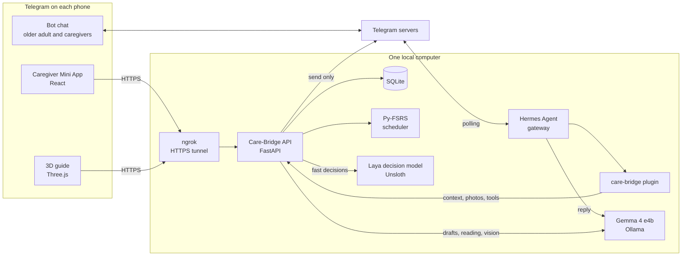
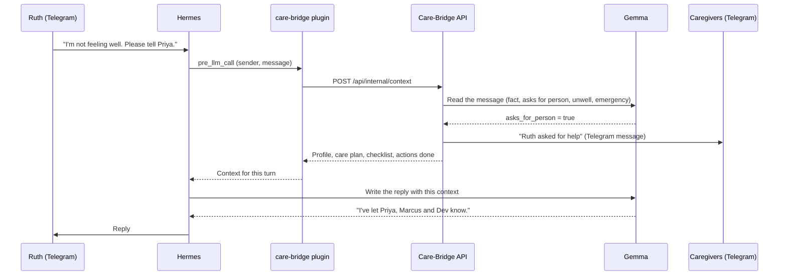
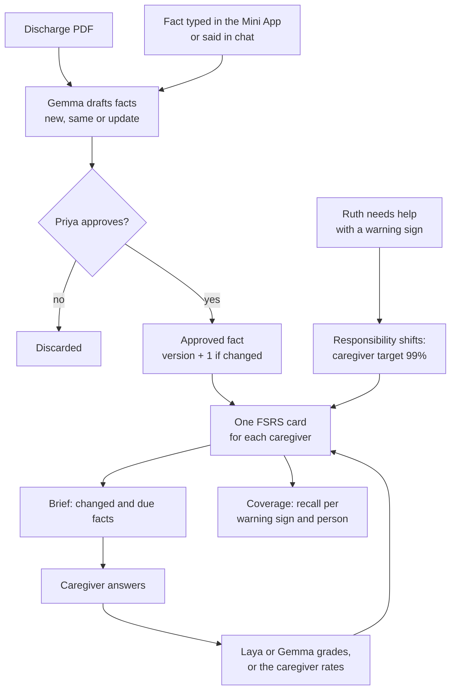

# Care-Bridge

Care-Bridge is a shared care memory for everyone who looks after an older adult. It runs in Telegram. Caregivers use a Telegram Mini App. The older adult uses a normal Telegram chat. The AI models run on one local computer, so health information stays at home.

All people, health details and documents in this repository are fictional.

## The problem

Care for an older adult is rarely one person's job. A daughter manages the care plan. A paid aide comes on weekdays. A son covers the weekends. Each person knows part of what keeps the older adult safe.

That knowledge moves badly between people. The primary caregiver holds most of it in her head. A new dose after a hospital stay, an allergy or a warning sign can get lost at a handoff. When the aide forgets a warning sign, or the son does not know that a dose changed, the older adult can go back to hospital.

Current tools store information in binders, group chats and care apps. They do not check whether the next caregiver remembers it. They also do not change when the older adult's own memory gets worse. The older adult is usually left out, because most technology is not designed for them.

## What Care-Bridge does

Care-Bridge keeps one approved care plan for one older adult. In the demo, she is Ruth, 78, with heart failure and early memory loss. Her circle is Priya (daughter, primary caregiver), Marcus (weekday aide) and Dev (son, weekends).

For caregivers, the Mini App has these parts:

| Part | What it does |
|---|---|
| Handbook | Care facts with their source: medicines, warning signs, routines, mobility, diet and contacts. A caregiver can upload a discharge PDF. Gemma drafts facts from it and finds changes, for example a dose that went from 20 mg to 40 mg. Priya approves each fact before the circle sees it. |
| Brief | Each caregiver gets a short set of cards for the facts they are about to forget. FSRS spaced repetition schedules the cards. Changed facts come first. Warning signs get a higher recall target. |
| Coverage | For each warning sign, the app shows how likely each caregiver is to remember it today. It shows an alert when only one person reliably knows a warning sign. |
| Today | The daily checklist for medicines, meals and health checks. A tick records who did it and when. A caregiver can mark an item as skipped or refused and add a note. |
| Health records | A caregiver sends a photo of a lab report to the bot. Gemma reads the values and the bot confirms which results are out of range. Care-Bridge copies the values. It does not interpret them. |
| Reports | Priya can get a 7-day or 30-day report as a PDF or CSV. She can download it or get it in her Telegram chat. |
| Changes | A history of what changed and who changed it. |

For the older adult, the Telegram chat does these things:

- Ruth asks questions in her own words, for example "My ankles look puffy, what was I supposed to do?". The bot answers only from her approved care plan.
- For some care facts, the bot sends a "Show me" button. It opens a short 3D guide with large text, one step at a time. A wrong tap only highlights the correct object.
- If Ruth asks for a person or describes an emergency, the backend tells the whole circle immediately. In other cases, the bot asks her before it tells anyone.
- Ruth never sees caregiver-only notes.

For the whole circle, Care-Bridge also moves responsibility. When Ruth stops reliably remembering a warning sign, the caregivers become responsible for it. Care-Bridge then raises their recall target for that fact to 99%.

Caregivers can also ask the bot questions in the chat. The bot uses the full care context: Ruth's profile, the handbook, coverage, briefs, today's checklist, health records and recent changes. If a caregiver gives new care information in the chat, Care-Bridge saves it as a draft for Priya to approve.

## Architecture



### Components

| Component | Responsibility |
|---|---|
| Hermes Agent | Polls the Telegram bot, keeps chat sessions and writes replies with Gemma. Hermes is the only process that reads messages from the bot. |
| care-bridge plugin | Gets Care-Bridge context before each reply (`pre_llm_call`). Sends incoming photos to the API (`pre_gateway_dispatch`). Gives Gemma two tools. |
| Care-Bridge API | Owns the care circle, facts, cards, schedules, logs, health records and events. Checks Telegram sign-in for the Mini App. Sends Telegram messages and files. Serves the Mini App and the 3D guide player. |
| Gemma 4 e4b | Drafts facts from PDFs, reads photos of medical documents, reads chat messages, grades typed answers and writes replies. |
| Laya | Makes fast typed decisions. Care-Bridge uses its answer only when Laya is very sure. In other cases, Gemma decides. |
| Py-FSRS | Schedules one card for each caregiver and each fact. Estimates recall for the coverage view. |
| SQLite | Stores all data in one file on the local computer. |

### A message from the older adult



The API sends the alert. Gemma does not decide to send it. The context tells Gemma what the system did, so the reply is correct.

### From a document to what caregivers remember



## Design rules

- The model drafts and people approve. Gemma never approves a fact.
- Python decides. Facts, schedules, grades, alerts and messages come from deterministic code. The model reads text and writes replies.
- Every model output is structured JSON. The API validates it before use. For example, a 3D guide is a list of steps for a fixed template, and the API rejects a step list that loses a number from the fact.
- The API filters what the older adult can see before the model gets the context.
- The older adult's request is her consent. If she does not ask, the bot asks her first. An emergency goes to the circle immediately.
- Health records are copied, never interpreted. The bot tells people to ask the doctor what results mean.
- All models run locally.

## Technology

| Area | Technology |
|---|---|
| Chat and agent | [Hermes Agent](https://github.com/NousResearch/hermes-agent), Telegram Bot API |
| Language and vision model | Gemma 4 e4b (`gemma4:e4b-mlx`) on Ollama |
| Decision model | Laya, through the Unsloth Studio Decision API |
| Spaced repetition | [Py-FSRS](https://github.com/open-spaced-repetition/py-fsrs) 6.3.2 |
| Backend | Python, FastAPI, SQLite, pdfplumber, fpdf2 |
| Caregiver app | React, TypeScript, Vite, Telegram Mini Apps |
| Older adult's guides | Three.js, TypeScript, Vite |
| Landing page | Next.js (`web/`) |
| Public HTTPS | ngrok |

## Repository layout

```text
services/api/                 Care-Bridge API: FastAPI, SQLite, Py-FSRS, Gemma, Laya and Telegram clients
apps/miniapp/                 Caregiver Telegram Mini App
apps/explainer/               3D guide player for the older adult, served at /explain/
hermes/plugins/care-bridge/   Hermes plugin; hermes/deploy.sh copies it into ~/.hermes
demo/                         Seed data, fictional discharge PDF and fictional CBC report
scripts/start.sh              Builds both web apps and starts the API on port 8000
web/                          Landing page
docs/                         Product, plan, runbook, demo script and project brief
```

## Run it

You need:

- Python 3.12 or later and Node.js 22 or later
- [Ollama](https://ollama.com) with `gemma4:e4b-mlx` pulled
- Hermes Agent connected to Ollama and to a Telegram bot
- Optional: Unsloth Studio with the Decision API on, for Laya
- Optional: ngrok, to open the Mini App inside Telegram

1. Put your settings in `local.env` in the repository root. Git ignores this file. Do not commit tokens.
2. Start the API. The script installs the dependencies, builds both web apps and starts the API on port 8000.

   ```bash
   ./scripts/start.sh
   ```

3. Open `http://localhost:8000`. With `CAREBRIDGE_DEV_AUTH=1`, a "View as" menu lets you test as Priya, Marcus or Dev in a normal browser.
4. Install the Hermes plugin, then restart Hermes.

   ```bash
   ./hermes/deploy.sh
   ```

5. For Telegram, start an ngrok tunnel to port 8000, set `CAREBRIDGE_PUBLIC_URL`, and set the bot's menu button to that URL.

The [runbook](docs/hackathon/runbook.md) gives each step in full, with the Hermes, BotFather, ngrok and Laya settings.

### Settings

| Name in `local.env` | Purpose |
|---|---|
| `TELEGRAM_BOT_TOKEN` | Bot token. The API uses it to check Mini App sign-in and to send messages. |
| `CAREBRIDGE_PUBLIC_URL` | The HTTPS address of the Mini App, for example your ngrok domain. |
| `CAREBRIDGE_DEV_AUTH` | `1` allows the "View as" test sign-in. Use `0` on a public URL. |
| `CAREBRIDGE_TELEGRAM_IDS` | Connects seed people to Telegram accounts, for example `priya:123,marcus:456`. |
| `CAREBRIDGE_BOT_USERNAME` | The bot's username, for invite links. |
| `CAREBRIDGE_MODEL`, `OLLAMA_URL` | The Gemma model and the Ollama address. |
| `LAYA_URL`, `LAYA_API_KEY` | The Laya Decision API. The key is optional on localhost. |

### Tests

```bash
cd services/api && .venv/bin/python -m pytest -q
```

The tests run without Telegram, Gemma or Laya. They cover sign-in, briefs, FSRS reviews, coverage, changes, permissions, chat context and privacy, alerts, guides, daily logs, reports and health records.

## Demo data

`demo/seed.json` has Ruth's profile, her circle, 15 care facts, review history, 9 daily schedule items and two weeks of logs. The demo also uses two fictional documents:

- `demo/ruth-discharge-2026-10-02.pdf`: discharge instructions that change her water pill dose
- `demo/ruth-alvarez-cbc-2026-10-06.png`: a blood test with four results out of range

"Reset demo data" in the Mini App restores the seed. The [demo script](docs/hackathon/demo-script.md) is a 4-minute walkthrough for four phones.

## Known limits

- Gemma uses about 17 GB of memory on an 18 GB computer. Ollama handles one request at a time, so a reply can take 30 seconds when Gemma is busy or reloads.
- On the demo blood test, Gemma reads 17 of 20 result rows. It finds all the out-of-range results.
- Alone, Laya was not accurate enough for grading or for selecting facts. Care-Bridge uses it only when it is very sure.
- Voice messages and other languages are not tested.
- Care-Bridge has no clinical validation. It is a hackathon prototype.

## Team

| Name | GitHub | Contribution |
|---|---|---|
| Nehal Joshi | [@nehal-joshi](https://github.com/nehal-joshi) | Care-Bridge API, Mini App, 3D guides, Hermes plugin and local models; plays Marcus in the demo |
| Amey | [@perfect7613](https://github.com/perfect7613) | Landing page (`web/`); plays Ruth in the demo |
| Kush Anchalia | [@KushAnchalia](https://github.com/KushAnchalia) | First prototype server and dashboard; plays Dev in the demo |
| Abhishree Verma| [@abhishree07](https://github.com/abhishree07) | Testing and demo; plays Priya in the demo |

## Documents

- [Demo script](docs/hackathon/demo-script.md)
- [Project brief](docs/hackathon/project-brief.md)
- [Runbook](docs/hackathon/runbook.md)
- [Feature list and hackathon scope](docs/hackathon/feature-list.md)
- [Execution plan](docs/hackathon/execution-plan.md)
- [Product ideas for aging populations](docs/ideas/ai-for-aging-populations.md)
- [The original FSRS coach bot](docs/prototype/fsrs-coach-bot-one-pager.md)
